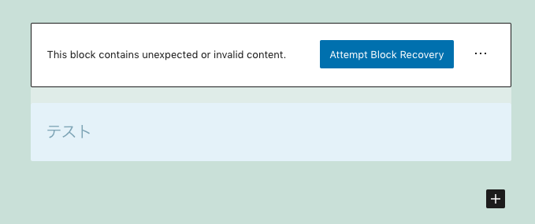

<!-- 
theme: vk-slide
size: 16:9
paginate: true
style: |
_paginate: false 
-->
<!-- _class: title -->
<!-- Scoped style -->
<style scoped>
  /*
section{
  background: yellow;
}
*/
</style>

<!--

僕たちはそろそろカスタムブロック開発の後方互換が辛い問題に立ち向かわなければいけない。【サンプルコード付き】

## 想定観客

職種
- カスタムブロック開発者

スキルレベル
- 後方互換性の維持に苦労している
- 後方互換姓を実装したことのある人

発表後に得るもの
- 後方互換テストの概要
- 実装方法

-->

<!-- _class: title -->
# 僕たちはそろそろ<br>カスタムブロック開発の後方互換が<br>辛い問題に立ち向かわなければ<br>いけない。
<small>2020.12.26</small><small> @ Tokyo WordPress Meetup</small>

大橋直記


---

<style scoped>
  .qr-container {
    text-align:right;
    margin-right:80px;
  }
  .qr-img {
    width:130px;
    margin-left:20px;
  }
  .img-round {
    border-radius: 50%;
    width:  300px;
    height: 300px;
  }
   li {
    font-size:30px
  }
  .container-naoki{
    display:flex;
  }
</style>
## 自己紹介

<div class="container-naoki">
  
  <ul>
    <li>大橋直記 / Naoki Ohashi</li>
    <li>Engineer / VK Blocks・VK Blocks Pro</li>
    <li>本州最南端在住</li>
    <li style="display:flex;align-items: center;">Twitter: <a href="https://twitter.com/naogify">@naogify</a> 
    </li>
  </ul>
</div>

 <!-- <div class="qr-container">
  
</div> -->

---

##  今日話すこと

VK Blocks ・VK Blocks Proに後方互換テストを導入（中）した
その経緯と実装方法について。

---

## ブロックが壊れた経験ないですか？




---

##  ブロックは壊れやすい
ブロックのDOM構造を変更すると壊れる

旧

```
save({ attributes }) {
  return (<div>Alert Block</div>);                    
}
```
新

```
save({ attributes }) {
  return (<p>Alert Block</p>);                        
}
```

---

###  後方互換を保つには


```
// 互換性を保つコードを追加する必要がある。

registerBlockType('example/alert', {
  ...
  deprecated:[
      {
          attributes: {
            ...
          },
          save({ attributes }) {
            return (<div>Alert Block</div>);
          }
      }
  ];
}
```

---

## 課題

- ブロックが壊れた報告がきた場合、**コミット履歴から、<br>過去バージョンごとにテスト**していく必要がある。

- チーム開発時に **「後方互換処理が動作」の確認コスト** が<br>バカにならない。

<!-- - バグ報告があった時に、コミット履歴から原因を探すのが辛い -->

---

# 辛すぎる…。
確認コストに時間が取られて、**新規開発ができない**。

---

# Gutenbergは、<br>どうしているのか…🤔？

---


## コアの後方互換テスト調べて<br>実装してみた。

テストのサンプルコードをGitHubで公開。
https://github.com/vektor-inc/block-test-kit


---
## テストファイルの構成

```
root/
├ src/
│   └ lindex.js、edit.js等 （ブロック本体）
├ test/
│   └ e2e-tests/fixtures/blocks/
│     ├ block-test-kit__alert.html（ブロックデータ）
│     ├ block-test-kit__alert.parsed.json （ブロックデータパース後）
│     ├ block-test-kit__alert.json（ブロックデータJSON）
│     └ block-test-kit__alert.serialized.htm│（ブロックデータシリアライズ化）
│
├ integration/full-content/full-content.test.js（後方互換テストファイル）
│
├ utils.js（テストに必要な関数）
│
└ page.json 等環境設定ファイル
```
---

## テストの概要

各バージョンのブロックのデータを、<br>投稿が保存されるフローをコードで再現してブロックが<br>壊れないか確認。

Version 1.0
```
<!-- wp:block-test-kit/alert --><p>Alert Block</p><!-- /wp:block-test-kit/alert -->
```
Version 0.9
```
<!-- wp:block-test-kit/alert --><div>Alert Block</div><!-- /wp:block-test-kit/alert -->
```

---
<!-- _class: title-chapter  -->
<!-- _paginate: false  -->


# デモ

---

##  テスト内容

```

import { parse as grammarParse } from '@wordpress/block-serialization-default-parser';

// block-test-kit__alert.html を パースした結果と、
const parserOutputActual = grammarParse( htmlFixtureContent );

// block-test-kit__alert.parsed.jsonとを、
const parserOutputExpected = JSON.parse( parserOutputExpectedString );

//比較してテスト
expect( parserOutputActual ).toEqual( parserOutputExpected );

```
<!-- 
```

const blocksActual = parse( htmlFixtureContent );
const blocksActualNormalized = normalizeParsedBlocks( blocksActual);
expect( blocksActualNormalized ).toEqual( blocksExpected );

```

```

const { filename: serializedHTMLFileName, file: serializedHTMLFixtureContent } = getBlockFixtureSerializedHTML( basename );
serializedExpected = serializedHTMLFixtureContent;

const serializedActual = serialize( blocksActual ) + '\n';

expect( serializedActual ).toEqual( serializedExpected );
``` -->

---

詳細なテストの手順はこちらのブログを参考に

https://www.vektor-inc.co.jp/post/deprecated-test-for-custom-block/


---

## メリット
- レビューの効率化（確認コストが段違いに減る!）
- フォーラムへのバグ報告数減（予定）
- 新規開発の時間の確保

---
<!-- _class: title -->
<!-- _paginate: false  -->


# ありがとうございました

<!-- 
# 見出し１

---

## 表

| | 表示名 | スラッグ |
|-| ------------- | ------------- |
| 投稿タイプ | 制作実績  | showcase  |
| カスタム分類 | サイト種別・機能  | site_type  |
| カスタム分類 | 担当範囲 | in_charge  |
| カスタム分類 | 業種  | industry  |

---

## アラート

<div class="alert alert-info">テスト</div>
<div class="alert alert-success">テスト</div>
<div class="alert alert-warning">テスト</div>
<div class="alert alert-danger">テスト</div>
 -->
