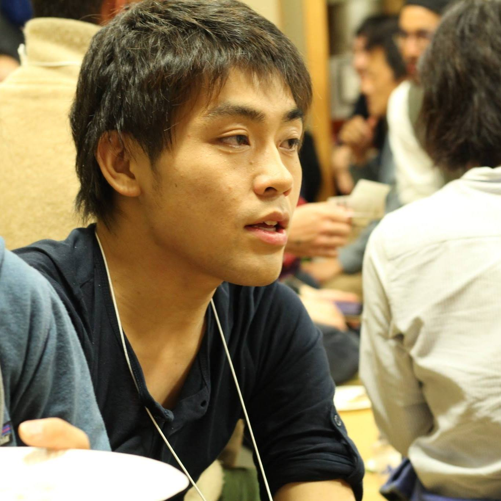

<!-- 
theme: default
size: 4:3
paginate: false
-->

<!-- Scoped style -->

<!-- _class: title -->

# Webエンジニア👨‍💻が衛星データで、 夜景の価値を計算してみた
<!-- # 衛星データ初心者が、 Tellusで六甲山の夜景の価値を 計算してみた🛰 -->

<small>2020/12/22</small>

大橋直記 @ Tellus Satellite Cafe vol.5

---

## ⭕️ 話す
- Webエンジニアが衛星データ解析を始めるキッカケ、Tellusを使った夜景の価値算出方法のプロセス

## ❌ 話さない
- 夜景の価値算出のための具体的な計算式・コード
<small>(宙畑の記事をご覧ください!)</small>

---

## 自己紹介

  
  <ul>
    <li>大橋直記 / Naoki Ohashi</li>
    <li>Webエンジニア、WordPress/React</li>
    <li>SpaceAppsKushimoto2020実行委員長</li>
    <li>本州最南端在住</li>
    <li>Twitter:  <a href="https://twitter.com/naogify">@naogify</a> or QRコード👇
    </li>
  </ul>

 

  

---

---
<!--
_color: #ccc
_text-align: center
-->

## なぜ衛星データに関わる事になったか？

1. 串本に**民間初のロケット発射場**が誘致

1. **SpaceApps Kushimoto**開催

1. 宙畑へ寄稿のお誘い

---

## 1記事目
**富士山から2点間の見通し計算**

<figcaption>
  <small>Credit : METI and Sorabatake</small>
</figcaption>
<small>標高データと三角関数等を使って計算</small>
<a href="https://sorabatake.jp/12087/">https://sorabatake.jp/12087/</a>

---

## ツッコミが…😱！

地球の丸さを計算に入れてなかったので、 各方面からツッコミが…。

---
## 2記事目

**大気の反射と地球の丸みを考慮して再計算**

<figcaption>
  <small>Credit : METI and Sorabatake</small>
</figcaption>
<a href="https://sorabatake.jp/12928/">https://sorabatake.jp/12928/</a>

---

## 3記事目
**六甲山からの可視範囲を計算**

<figcaption>
<small>Credit : METI and NASA(ASTER GDEM), OpenStreetMap Contributors, Geolonia</small>
<small>Source : https://www.openstreetmap.org/copyright</small>
</figcaption>

<small>OpenStreetMapから抽出した建物に対して見通し計算。 見える建物  × 一戸あたりの電気代の平均を計算して夜景の価値を算出。</small>
<a href="https://sorabatake.jp/15363/">https://sorabatake.jp/15363/</a>

---

# 衛星データのハードルは意外と低い！

- 専門知識もなくても大丈夫
- 事例は宙畑を参考に
- 衛星データ解析の第一歩をTellusで

---

# ありがとうございました!