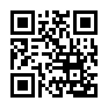

<!-- 
theme: uncover
size: 16:9
paginate: false
-->

<!-- Scoped style -->

# 衛星データと高校数学で 夜景の価値を計算してみた

<small>2020/12/22</small>
<small>Tellus Satellite Cafe vol.5</small>
大橋直記 

---

## 解説する記事
<small>神戸の夜景は何万ドル？衛星データを使って実際に計算してみた</small>

https://sorabatake.jp/15363/

---

## 100万ドルの夜景の根拠

<small>
<blockquote>
1953年（昭和28）年、当時の電力会社の副社長が、六甲山から見る夜景のすばらしさに感動。その感動が忘れられなかった彼は、なぜか山頂から見える大阪・尼崎・芦屋・神戸の電灯の数を計算したという。すると、その数は496万7000個で、その電気代はひと月で4億2900万円。これを当時の1ドル＝360円で計算すると、100万ドル強になったのである。

話がはずむ「ムダ知識」（PHP研究所）
</blockquote>
</small>

---

## 自己紹介

  
  <ul>
    <li>大橋直記 / Naoki Ohashi</li>
    <li>Webエンジニア、WordPress/React</li>
    <li>SpaceAppsKushimoto2020実行委員長</li>
    <li>本州最南端在住</li>
    <li>Twitter:  <a href="https://twitter.com/naogify">@naogify</a> or QRコード👇
    </li>
  </ul>

 

  

---

---
<!--
_color: #ccc
_text-align: center
-->

## 衛星データにかかわるキッカケ

1. 串本に**民間初のロケット発射場**が誘致

1. **SpaceApps Kushimoto**開催

1. **宙畑へ寄稿**のお誘い

---

**1. 富士山から2点間の見通し計算**

<figcaption>
  <small>Credit : METI and Sorabatake</small>
</figcaption>
<!-- <small>使用データ：ASTER GDEM 2.0</small> -->

---

**標高データ（ASTER GDEM 2.0）**

- NASAの地球観測衛星Terraの観測データを元に作成された数値標高モデル。
- 分解能: 30メートル四方、高さ方向が1メートル
---

**手順**
1. 【標高データ】: 2地点間の標高データを取得。
1. 【視線の高さ】: 2地点の標高差と距離から、三角関数を使いtanΘを計算。
（底辺がX(m)の時の、高さY(m)が導ける)
1. 観測地点から対象地点までの直線上を、2で計算した視線の高さと標高を比較。

<small><a href="https://sorabatake.jp/12087/">https://sorabatake.jp/12087/</a></small>

---

## ツッコミが…😱！

地球の丸みを計算に入れてなかったので、 各方面からツッコミが…。

---
**2.大気の反射と地球の丸みを考慮して再計算**

<figcaption>
  <small>Credit : METI and Sorabatake</small>
</figcaption>

---

**手順**

1. 2点間の距離を計算
2. 三平方の定理を使い、d1（2点間の距離/2）と R（地球半径）から h1（h0から見える最大の高さ）を計算。
3. 対象地点の標高と h1 を比較。
 

<small>
<ul>
<li>
記事 
<a href="https://sorabatake.jp/12928/">https://sorabatake.jp/12928/</a>
</li>
<li>
参考：地球の丸みを考慮した可視性の式 
<a href="https://github.com/dizzib/earthcalc">https://github.com/dizzib/earthcalc</a>
</li>
<li>参考：2地点間の距離計算 <a href="https://qiita.com/r-fuji/items/99ca549b963cedc106ab">https://qiita.com/r-fuji/items/99ca549b963cedc106ab</a></li>
</ul>
</small>

---

**3.六甲山からの可視範囲を計算**

<figcaption>
<small>Credit : METI and NASA(ASTER GDEM), OpenStreetMap Contributors, Geolonia</small>
<small>Source : https://www.openstreetmap.org/copyright</small>
</figcaption>

<small>OpenStreetMapから抽出した建物に対して見通し計算。 見える建物  × 一戸あたりの電気代の平均を計算して夜景の価値を算出。</small>

---

**手順**
1. Osmiumを使い六甲山周辺の建物（`building` キーを含む `way`） を取得。
1. 取得した建物の座標（緯度経度）を、前記事「大気の反射と地球の丸みを考慮して再計算」の計算式で、見通し計算。

<small><a href="https://sorabatake.jp/15363/">https://sorabatake.jp/15363/</a></small>

---

# 衛星データのハードルは 意外と低い！

- 高校数学が分かれば大丈夫!?（一次方程式/三平方の定理/三角関数）
- Tellusを使えばAPIで衛星データを扱える

---

# ありがとうございました!

<!--
対象読者
職種
1. 研究者
2. Webエンジニア

興味レベル
1. 衛星データに趣味や仕事で触れている、夜景をどのように計算したかを知りたい
2. まったく知らない。

この発表をみた後に、何を観客は得れるか？
- 夜景の計算の仕方
- 三角関数と基本的な数学で、計算できた。
>